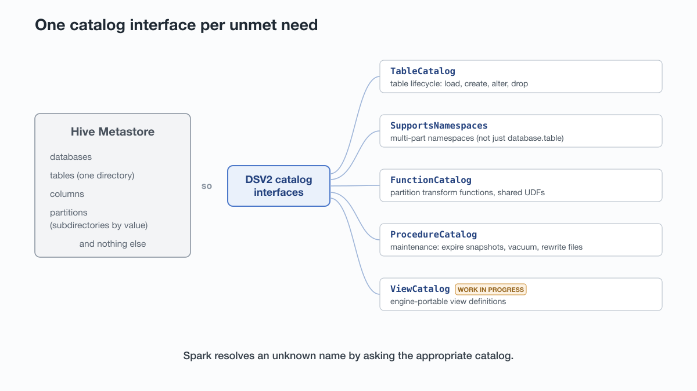
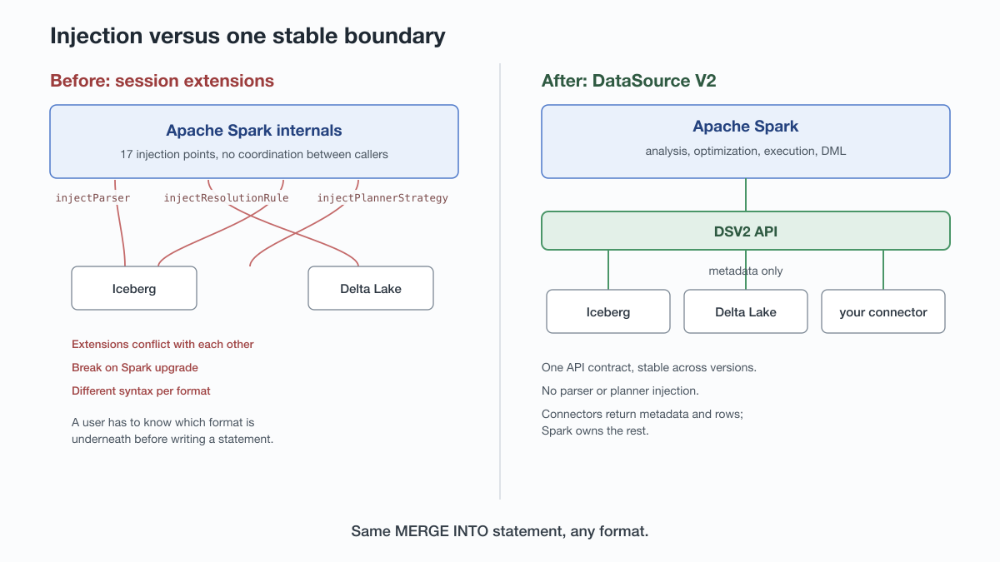
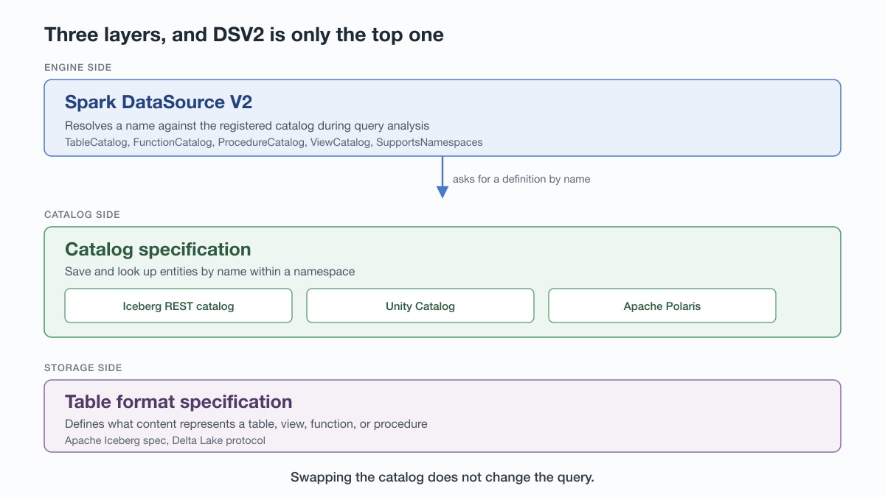
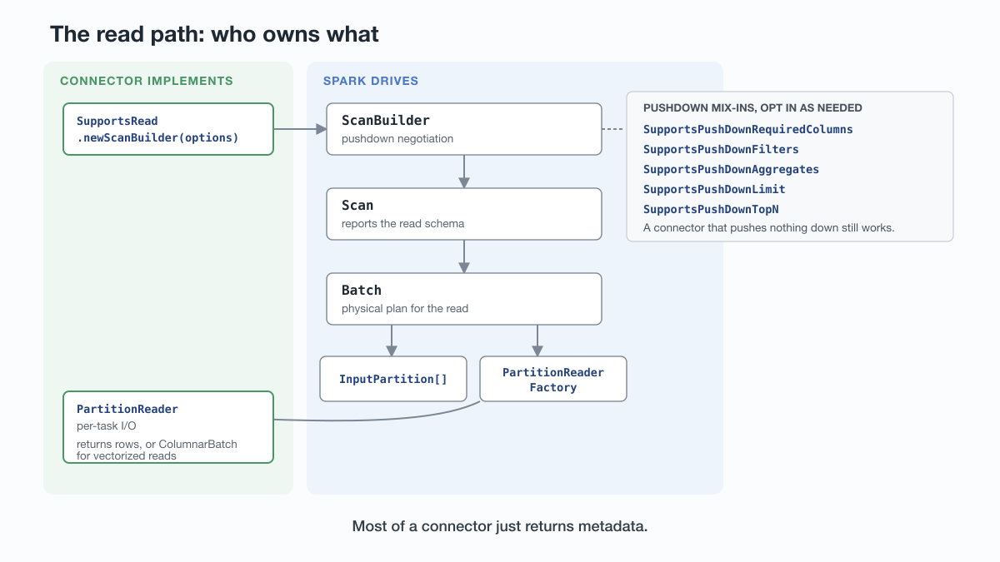
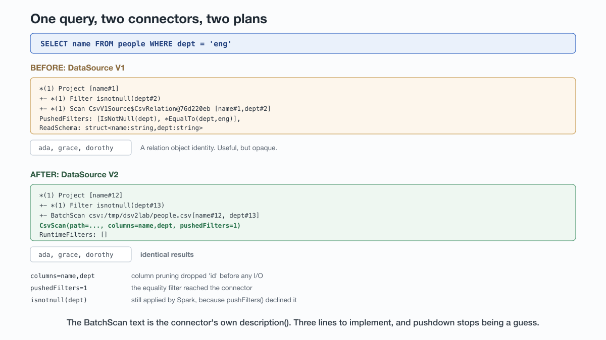

# What Is Spark DataSource V2? How Apache Spark Made Table Formats Pluggable

*By Lisa N. Cao and Szehon Ho*

## Key takeaways

- **DataSource V2 (DSV2) is the Apache Spark API that lets an external table format plug into Spark as a first-class citizen**, not just as a source of bytes to read and write.
- **DSV1 covered reading and writing files.** DSV2 covers metadata: catalogs that resolve tables, functions, procedures, views, and multi-part namespaces.
- **The Hive Metastore modeled tables, columns, and partitions.** Formats like Apache Iceberg and Delta Lake need versioned metadata, time travel, and transactional guarantees over millions of rows, so Spark needed a wider plug-in surface than a metastore wrapper.
- **Before DSV2, connectors injected custom parser rules and execution strategies through Spark session extensions.** That pattern conflicts across libraries, breaks on Spark upgrades, and forces users to learn per-format syntax.
- **The design goal is that users never notice DSV2 at all.** The same `MERGE INTO` runs against Iceberg and Delta Lake, and the connector implementation is thin enough to swap without touching the query.

## What is DataSource V2 in Apache Spark?

DataSource V2 is the Apache Spark API that external data sources implement to integrate with Spark's analyzer, optimizer, and execution engine. Where the original DataSource V1 API covered reading and writing data, DSV2 expands the surface area to metadata: a DSV2 connector plugs catalogs into Spark, and those catalogs resolve tables, functions, procedures, views, and namespaces during query analysis.

The practical result is that Apache Iceberg, Delta Lake, and any other table format can expose the same user experience through Spark. The same `MERGE INTO` statement, the same maintenance procedure syntax, and the same execution path apply regardless of what stores the metadata underneath.

DSV2 is easier to understand by asking what it replaced, so this piece works through the Hive Metastore's limits, the fragile pattern that preceded DSV2, the boundary between a table format and an engine, and what is still missing.

## Why wasn't the Hive Metastore enough?

The Hive Metastore modeled a narrow set of entities: databases, tables that map to a directory, columns, and partitions that map to subdirectories keyed by column values. That model survived far longer than its simplicity suggests it should have, and for a decade it was sufficient, because the data lived in Parquet files and the metadata layer above them was thin.

Table formats broke that assumption. The reason Iceberg and Delta Lake became dominant is not the file format, since both sit on Parquet. It is the metadata layer, which is rich enough to give transactional guarantees over huge operations. Modifying millions of rows safely requires metadata versions, snapshot lineage, time travel, and row-level lineage, none of which the Hive Metastore expressed.

Extending Spark's read and write path would not have helped, because reading and writing was never the problem. The gap was in everything around the data: which entities a data source can define, and how Spark resolves them.

### Namespaces

The Hive Metastore addressed a table as `database.table`, a fixed two-level hierarchy. Iceberg supports multi-part namespaces, so Spark needed a way for a catalog to declare arbitrary namespace depth rather than assuming two levels. The `SupportsNamespaces` mix-in covers this, with `listNamespaces`, `createNamespace`, `alterNamespace`, and `dropNamespace`.

### Partition transforms

Hive-style partitioning uses the value of a column as the partition. Iceberg partition transforms instead apply a function to a column to decide where a row lands, such as bucketing an identifier or truncating a timestamp to days. Spark cannot resolve a function it does not know about, which is one of the needs that motivated a pluggable function catalog. `FunctionCatalog.loadFunction` returns an `UnboundFunction`, and a table's `partitioning()` returns `Transform` values such as `IdentityTransform`, `BucketTransform`, and `YearsTransform`.

### Procedures and views

Table formats ship with maintenance operations: expiring old snapshots, vacuuming orphan files, rewriting data files, and clustering a table for better layout. The rich metadata layer is a double-edged sword, because metadata that enables time travel also has to be maintained. There was no way to look up a procedure in the Hive Metastore, since procedures were not modeled there at all. Spark now exposes `ProcedureCatalog`, whose `loadProcedure` returns an `UnboundProcedure`, invoked as `CALL catalog.procedure(args)` ([Spark DSV2 docs](https://spark.apache.org/docs/4.2.0/sql-data-sources-v2.html)).

Views are a subtler case. The Hive Metastore does store views, so the gap is not their existence but their portability: an engine-neutral view specification with defined dialect handling is a different thing from a stored view definition that only one engine can interpret. `ViewCatalog` exists in the DSV2 API surface, and the Spark documentation describes it as work in progress, so treat portable views through Spark as an incomplete story rather than a shipped one.



The pattern repeats across each of these. Wherever a table format needed an entity Spark did not model, the catalog became the mechanism for plugging that entity in. When Spark analyzes a query and hits a name it cannot resolve, it consults the appropriate catalog, retrieves the definition, and continues. Governance reinforces the same design, because operators want tables, views, and functions governed together rather than through separate systems, which pushes the catalog toward being the central control point.

## Why not just use Spark session extensions?

Spark session extensions let a library inject a parser extension, resolution rules, and planner strategies directly into Spark, and both Iceberg and Delta Lake used that path in their early days. The pattern works, and it is also fragile enough that it should not be the way a data source integrates with Spark.

Three problems compound:

1. **Extensions conflict.** Injected rules from independent libraries have no coordination mechanism, so two extensions in one session can interfere.
2. **Extensions do not survive upgrades.** They hook into internals, so upgrading Spark frequently means upgrading a chain of libraries in lockstep just to keep the integration compiling.
3. **Syntax fragments.** Every data source ends up with its own dialect for the same operation, so a user has to know which format is underneath before writing a statement, and code does not port between them.

The last point is the one that reaches users. Before a unified DSV2, Iceberg and Delta Lake each had custom implementations of DML and of procedures, with different syntax for the same operation, and a query written against one did not move to the other.



### DSV1 vs session extensions vs DSV2

| Dimension | DataSource V1 | Session extensions | DataSource V2 |
|---|---|---|---|
| Scope | Read and write file-based sources | Arbitrary internal hooks | Catalogs, metadata entities, DML, execution |
| Metadata model | Thin wrapper over Hive Metastore | Whatever the extension implements | Pluggable catalogs per entity type |
| Namespaces | Two-level `database.table` | Custom | Multi-part, catalog-declared |
| Custom syntax | Not supported | Injected parser rules | Unified Spark syntax, no injection |
| Upgrade stability | Stable but limited | Breaks across versions | Stable API contract |
| Where complexity lives | Split | In the connector | In Spark |
| User awareness of format | Low | High, per-format dialects | None by design |

## Where does the table format end and the catalog begin?

Three layers stack, and keeping them separate resolves most of the confusion about what DSV2 does. The table format specification defines what content represents a table, a view, a function, or a procedure. The catalog specification defines an API for saving and looking those entities up by name within a namespace. DSV2 defines how Spark resolves a name against whichever catalog is registered, and it is deliberately indifferent to what stores the metadata.



That indifference is the point. During Spark's analysis phase, resolution takes a name the engine does not recognize, asks the registered catalog for a definition, and substitutes the result into the plan. A function catalog that returns a usable definition satisfies DSV2 whether it is backed by the Iceberg REST catalog, Unity Catalog, Apache Polaris, or something internal. Swapping the catalog does not change the query.

DSV2 is also scoped to Spark alone. It is not a cross-engine specification, and it does not translate one format's specification into another's. Interoperability between Iceberg and Delta Lake metadata is a separate effort happening at the format layer, between those two communities. DSV2 handles the engine-side question of how a Spark SQL statement resolves against whatever is registered.

### What is catalog federation, and why are there two kinds?

Catalog federation exists at two layers, which is why discussions of it tend to talk past each other.

**Logical federation, in Spark.** DSV2 resolution is catalog-based, and Spark can hold multiple catalogs at once. Registering several catalogs and addressing entities as `catalog.namespace.entity` sends each reference to the right catalog, whether the entity is a table, view, function, or procedure.

**Physical federation, in the catalog.** A catalog implementation can itself reference entities from other catalogs. Unity Catalog and Apache Polaris both support this, so a lookup arriving at one catalog may be served from another.

Spark's layer is logical, an addressing and resolution mechanism. The physical catalog owns the actual metadata representation. Both are called federation, and they are not the same thing.

## What does DSV2 unify for users?

DSV2 moves shared logic into Spark so every connector inherits it. Four things now work the same way regardless of format:

- **Row-level DML.** `MERGE`, `UPDATE`, and `DELETE` are implemented once in Spark, not once per format. `SupportsRowLevelOperations` covers both physical strategies, merge-on-read and copy-on-write, so a format picks its strategy without changing the user's SQL. `SupportsDeleteV2` handles the cheap case, dropping whole partitions or files without reading them.
- **Schema evolution.** `MERGE INTO ... WITH SCHEMA EVOLUTION` resolves misaligned source and target schemas in the engine, including type widening ([SPARK-54274](https://issues.apache.org/jira/browse/SPARK-54274)).
- **Transactions.** A catalog implementing `TransactionalCatalogPlugin` returns a `Transaction` from `beginTransaction`, and Spark runs multiple reads and writes inside it before calling `commit` or `abort`. That extends atomicity past the single-table staging `StagingTableCatalog` already offered, and the transaction's catalog tracks its own operations so the connector can resolve conflicts at commit time.
- **Change data capture.** `Changelog` ([SPARK-55668](https://issues.apache.org/jira/browse/SPARK-55668)) splits the work explicitly: the connector emits raw change rows carrying `_change_type`, `_commit_version`, and `_commit_timestamp`, and Spark does the post-processing, meaning carry-over removal, update detection, and net change computation. One implementation instead of one per connector, which is both better UX and usually faster.

Operation metrics ride along through `CustomMetric` and `CustomTaskMetric`, so a connector reports row counts into the Spark UI rather than inventing a side channel. That matters for `MERGE` in particular, where a rewrite carries real risk and users want confirmation of what changed.

None of these are clever APIs. The value is that each is done correctly once, on the Spark side, where it needs engine participation anyway.

## Why has DSV2 taken so long?

Because the extension-based integrations worked. Moving to a generic API meant connectors giving up capabilities, and Iceberg and Delta Lake were competing hard with real customer demand, so neither had an incentive to trade working features for architectural purity.

Two gaps made the trade concrete, and both are now being closed by handing connectors the real thing instead of a reduced abstraction.

**Expression coverage.** Spark's `FunctionRegistry` holds just over 500 built-in expressions. `GeneralScalarExpression`, which carries a pushed-down expression to a connector, documents 66. Aggregate pushdown is narrower still: `Min`, `Max`, `Sum`, `Count`, `CountStar`, `Avg`, plus an escape hatch. So a connector can push down a fraction of what Spark can evaluate, and the rest is computed after the data crosses the boundary. The fix in progress, `SupportsPushDownCatalystFilters`, hands a scan builder Catalyst expressions directly and skips translation entirely. Note it currently lives in `org.apache.spark.sql.internal.connector` and is used by Spark's own `FileScanBuilder`, so it is not yet something a third-party connector should build against.

**Readers and writers.** DSV1 let a connector reuse Spark's reader and writer and inherit their tuning. DSV2 required reimplementing both, which for a mature connector is a regression. The proposed fix, still at design stage, packages Spark's Parquet reader and writer so a connector can say "here is the file, use your own reader." That would also settle the native-reader question: plugging an accelerated reader such as Apache DataFusion Comet into each connector separately has been a live debate in the Iceberg community, and it mostly dissolves if reading delegates back to Spark.

### Does DSV2 support columnar and Arrow-based execution?

Yes. A `PartitionReader` iterates over either rows or `ColumnarBatch` instances, so a connector holding Arrow-backed data returns batches instead of rows and gets vectorized execution through the operator chain. The opt-in is the reader's return type rather than a configuration flag.

## How do I migrate to a DSV2 catalog?

Migration to DSV2 starts by registering a catalog, because DSV2 is catalog-based rather than path-based. Setting `spark.sql.catalog.<name>` to a catalog implementation is the entry point, after which references of the form `catalog.namespace.entity` resolve through that catalog:

```properties
spark.sql.catalog.my_catalog=com.example.MyCatalog
spark.sql.catalog.my_catalog.warehouse=s3://bucket/warehouse
spark.sql.defaultCatalog=my_catalog
```

Any property sharing the `spark.sql.catalog.<name>.` prefix is passed through to `CatalogPlugin.initialize(name, options)`, which is how a catalog receives its own configuration. `spark.sql.defaultCatalog` sets the catalog used when a name is not qualified, and defaults to `spark_catalog` ([configuration reference](https://spark.apache.org/docs/latest/configuration.html)).

Once a catalog is registered, the multi-part namespaces described earlier stop being theoretical. A catalog implementing `TableCatalog` and `SupportsNamespaces` supports this directly:

```sql
CREATE NAMESPACE demo.analytics;
CREATE NAMESPACE demo.analytics.regional;   -- three levels, no Hive Metastore equivalent
CREATE TABLE demo.analytics.people (id STRING, name STRING, dept STRING);
INSERT INTO demo.analytics.people VALUES ('1','ada','eng'), ('2','grace','eng');
SELECT name FROM demo.analytics.people WHERE dept = 'eng';
SHOW TABLES IN demo.analytics.regional;
```

The `demo.analytics.regional.emea` form is the concrete thing `database.table` could not express, and it is why namespace depth needed its own interface rather than a convention.

For most users, that is the whole migration. The larger share of the work sits with connector maintainers, who implement the DSV2 interfaces and, where a V1 connector already exists, keep behavior consistent so that existing code does not change meaning. Delta Lake is the case to watch, since it historically shipped a V1 connector, which makes the move to DSV2 a config-level change for users and a compatibility exercise for the community: the old connector's behavior has to carry over so that existing pipelines do not shift underneath their owners. Check the Delta Lake release notes for the current state rather than assuming, since this is actively moving.

Version coupling improves as a side effect. Deep custom integration meant that upgrading Spark often forced upgrading a chain of libraries, because the integration touched many internal points. A thin connector against a stable API can be swapped without that cascade.

### What actually changes when porting a V1 connector?

Porting a connector from DSV1 to DSV2 means splitting one class into a few small ones and adopting a commit protocol. The mapping below is taken from a pair of working connectors that read the same file and return identical results.


| DataSource V1 | DataSource V2 |
|---|---|
| `RelationProvider` | `TableProvider` |
| `BaseRelation` | `Table` (an interface, no `SQLContext` needed) |
| `BaseRelation.schema()` | `Table.columns()` (`schema()` is deprecated) |
| `TableScan.buildScan()` returning `RDD<Row>` | `ScanBuilder` to `Scan` to `Batch` to `PartitionReader<InternalRow>` |
| `PrunedScan` | `SupportsPushDownRequiredColumns` |
| `PrunedFilteredScan` | `SupportsPushDownFilters` |
| `unhandledFilters` | return value of `pushFilters` |
| `InsertableRelation.insert` | `WriteBuilder` to `Write` to `BatchWrite` to `DataWriter` |
| overwrite boolean | `SupportsTruncate` capability |
| no equivalent | `TableCatalog`, `SupportsNamespaces`, row-level DML, CDC, transactions |

Two of these are more than renames. Parallelism moves from the connector to Spark: a V1 `buildScan` returns an RDD the connector constructed, often by materializing rows on the driver, while a V2 connector returns serializable `InputPartition` descriptions and Spark creates the tasks. And the write path gains a real failure story, since V1's single `insert` call leaves the destination in whatever state it reached if it throws, whereas `BatchWrite` gives per-task commit and abort with a driver-side decision.

Three details cost real time when porting, all verified against Spark 4.2.0:

- **`InternalRow` is an internal API, and strings must be `UTF8String`.** V1's `Row` accepted a `java.lang.String`; putting one into a `GenericInternalRow` compiles and then throws `ClassCastException: class java.lang.String cannot be cast to class org.apache.spark.unsafe.types.UTF8String` at runtime. This is the sharpest edge in DSV2 and the clearest evidence the API is not fully insulated from Spark internals.
- **`createTable` has three overloads and two are deprecated.** Implement `createTable(Identifier, TableInfo)`. Older tutorials show the `StructType` or `Column[]` forms, both now deprecated.
- **There is no public helper converting `StructType` to `Column[]`.** Spark uses `CatalogV2Util.structTypeToV2Columns` internally, but it is `private[sql]`, so every connector writes the same short loop over `Column.create`.

## Should I write a DSV2 connector?

Probably yes, and it is less work than it sounds. A connector does not resolve names, plan execution, or implement operators. Most of what it does is hand Spark metadata and rows.



Pushdown is opt-in, one mix-in at a time, and a connector that pushes nothing down is still correct, just slower. That makes `pushFilters` the one method worth reading closely, because it is where a connector can quietly return wrong answers. It returns the filters the connector did **not** accept:

```java
@Override
public Filter[] pushFilters(Filter[] filters) {
  List<Filter> accepted = new ArrayList<>();
  List<Filter> rejected = new ArrayList<>();
  for (Filter f : filters) {
    if (f instanceof EqualTo eq && fullSchema.getFieldIndex(eq.attribute()).isDefined()) {
      accepted.add(f);          // this connector will apply it
    } else {
      rejected.add(f);          // Spark keeps applying it
    }
  }
  this.pushedFilters = accepted.toArray(new Filter[0]);
  return rejected.toArray(new Filter[0]);
}
```

Claim a filter and then fail to apply it in the reader, and rows that should have been removed come back with no error. Implementing `Scan.description()` costs three lines and makes the negotiation visible in `EXPLAIN`, which is how you confirm it worked rather than assuming:

```
BatchScan csv:/tmp/dsv2lab/people.csv[name#1, dept#2]
  CsvScan(path=/tmp/dsv2lab/people.csv, columns=name,dept, pushedFilters=1)
```

The division of labor reflects where expertise actually lives. Table format communities are good at storing data and metadata efficiently. They are not, and need not be, specialists in predicate pushdown and query planning.

Where to start:

- **The Spark 4.2 docs** now have a [dedicated DSV2 section](https://spark.apache.org/docs/4.2.0/sql-data-sources-v2.html) covering entry points, catalogs, read and write paths, and row-level DML.
- **Read existing connectors.** Iceberg, Delta Lake, LanceDB, and JDBC are all DSV2. So is the Python Data Source API, where `PythonDataSourceV2 extends TableProvider`, the same entry point a JVM connector uses. Spark's own examples sit in its test sources under `sql/core/src/test/java/test/org/apache/spark/sql/connector/`, though they still override the deprecated `Table.schema()`.
- **Report gaps upstream.** If the API does not meet a use case, raise it with the community rather than working around it.

## What is landing next in DSV2?

Recent work closes gaps rather than adding headline features. Here is the state of the plug-in surface as of Spark 4.2.

| Capability | Interface | State in 4.2 |
|---|---|---|
| Row-level DML | `SupportsRowLevelOperations`, `SupportsDeleteV2` | Available |
| Procedures | `ProcedureCatalog` | Available |
| MERGE schema evolution | `MERGE INTO ... WITH SCHEMA EVOLUTION` | Available |
| CDC | `Changelog`, `ChangelogRange` | New in 4.2 |
| Transactions | `TransactionalCatalogPlugin`, `Transaction` | New in 4.2 |
| Portable views | `ViewCatalog` | Present, documented as work in progress |
| Generated columns | `GenerationExpression` | Merged, not yet released |
| Catalyst filter pushdown | `SupportsPushDownCatalystFilters` | Internal package, not public API |
| Reader and writer reuse | Delegate Parquet I/O back to Spark | Design discussion |

No single item is a big bang. Taken together they move the stack toward working properly end to end, whatever sits underneath.

The forward-looking case for this work is that the connector space is where the innovation is happening. LanceDB pioneered table formats built for AI workloads, and vector types and new file layouts are arriving quickly. A stable, capable DSV2 means Spark does not need a winner among formats. Users can try different file formats and different table formats, with the same interface and the same performance characteristics, and switch when something better appears.

## Frequently asked questions

**Is DataSource V2 the same as Spark Connect?**

No. Spark Connect is a client-to-server protocol that decouples a client application from the Spark cluster. DataSource V2 is an in-process API that data sources implement so Spark can resolve and execute against their metadata. Both provide a stable boundary that survives version changes, but they sit at opposite ends of the engine: Spark Connect faces the application, DSV2 faces the storage layer.

**Do Spark users need to know whether they are using DSV2?**

No, and that is the design criterion. A successful DSV2 means the same `MERGE INTO` or maintenance procedure works whether the table is Iceberg or Delta Lake, with no format-specific syntax. Before DSV2, users did have to know, because each format shipped its own custom implementation and dialect.

**Does DSV2 replace DataSource V1?**

DSV2 is the path forward for new connectors, and V1 connectors continue to work. The migration cost historically fell on connector maintainers rather than users, since a V1 connector reusing Spark's readers and writers had to give those up to move. Ongoing work to let DSV2 connectors delegate reading and writing back to Spark reduces that cost.

**Is DSV2 specific to Apache Iceberg?**

No. DSV2 is format-neutral by design and is used by Iceberg, Delta Lake, LanceDB, and JDBC, among others. Iceberg's requirements did drive several catalog APIs, because Iceberg pushed on entities such as multi-part namespaces and partition transform functions that Spark did not model, but the resulting APIs are generic.

**Can Iceberg and Delta Lake share the same DML syntax?**

Yes, and that is one of the clearest wins of DSV2. Unifying `MERGE`, `UPDATE`, and `DELETE` in Spark rather than per connector means a query written against one format runs against the other, which was not true when each format implemented DML through its own session extension.

**Does the catalog now do more than the Hive Metastore ever did?**

Considerably more. The Hive Metastore tracked databases, tables, columns, and partitions. Modern catalogs track views, functions, and procedures as well, with multi-part namespaces, and they serve as the governance boundary for all of those entities together. The Iceberg REST catalog is substantially more expansive than the Hive Metastore in this respect.

## Tutorial: build a DSV2 connector and see the difference

The rest of this article is a hands-on walkthrough with the code inline, so it reads without a checkout. Every snippet below is real code from the project in this repository (`demos/03_dsv2_connector`), which contains a DSV2 connector, the same source written against DSV1, and a catalog, all running against Apache Spark 4.2.0. Every plan and table shown is captured output, not an illustration.

Prerequisites are a JDK 17 or 21 and an Apache Spark 4.2.0 install. Nothing else needs downloading, because the project compiles against the jars in your Spark distribution.

The connector is eight files, and the order below is also the order to read them:

```
v2/CsvV2Source.java        TableProvider, the entry point
v2/CsvTable.java           Table, and why capabilities() matters
v2/CsvScanBuilder.java     pushdown negotiation and partition planning
v2/CsvInputPartition.java  a serializable unit of work
v2/CsvReaderFactory.java   per-task I/O, where InternalRow bites
v2/CsvWriteBuilder.java    the write path and two-phase commit
v2/CsvFile.java            storage plumbing, not DSV2
v2/CatalogHelpers.java     StructType to Column[], because there is no public one
```

### Step 0: run the before/after demo

```bash
./demo.sh
```

The demo runs one query, `SELECT name FROM people WHERE dept = 'eng'`, against the same five-row CSV file through three connectors, and prints the physical plan each time. Start here, because the plans are the whole argument.

```
  people.csv:
    id,name,dept
    1,ada,eng
    2,grace,eng
    3,alan,research
    4,katherine,math
    5,dorothy,eng
```

### Step 1: what the DSV1 version looks like

The V1 connector is a `RelationProvider` returning a `BaseRelation` that mixes in `PrunedFilteredScan` and `InsertableRelation`. The whole read path is one method returning an RDD:

```java
public static class CsvRelation extends BaseRelation
    implements PrunedFilteredScan, InsertableRelation {

  @Override
  public RDD<Row> buildScan(String[] requiredColumns, Filter[] filters) {
    // ... read and filter every line, build a List<Row> ...
    JavaSparkContext jsc = JavaSparkContext.fromSparkContext(sqlContext.sparkContext());
    JavaRDD<Row> rdd = jsc.parallelize(rows, 2);
    return rdd.rdd();
  }

  /** Declared separately from buildScan, which is the hazard. */
  @Override
  public Filter[] unhandledFilters(Filter[] filters) { ... }
}
```

Note `parallelize(rows, 2)`: the driver has already materialized every row before Spark sees any of them. That is typical of V1 connectors and it is the thing Step 2 fixes.

It works, and the demo's first section shows it returning the right answer:

```
  Physical plan:
    *(1) Project [name#1]
    +- *(1) Filter isnotnull(dept#2)
       +- *(1) Scan com.example.dsv2lab.v1.CsvV1Source$CsvRelation@76d220eb [name#1,dept#2]
          PushedFilters: [IsNotNull(dept), *EqualTo(dept,eng)],
          ReadSchema: struct<name:string,dept:string>
```

Pushdown happens: the star on `*EqualTo(dept,eng)` marks the filter the connector claimed. Three things are true about this connector, though, and the third is the one that matters:

1. It builds the RDD itself, because `buildScan` returns `RDD<Row>`, so the driver materializes rows.
2. It reports leftover filters through a separate `unhandledFilters` method, which can drift out of sync with what the scan actually applies.
3. It cannot be addressed as `catalog.namespace.table`, cannot support `CREATE TABLE`, and cannot do MERGE, CDC, or transactions. Not "does not yet". A V1 source has no catalog to hang any of that on.

### Step 2: port the read path

The V2 entry point is `TableProvider`, which answers a narrower question than `createRelation` did: given these options, what table is this?

```java
public class CsvV2Source implements TableProvider {

  @Override
  public StructType inferSchema(CaseInsensitiveStringMap options) {
    return CsvFile.from(options).schema();
  }

  @Override
  public Table getTable(
      StructType schema, Transform[] partitioning, Map<String, String> properties) {
    return new CsvTable(schema, CsvFile.from(new CaseInsensitiveStringMap(properties)));
  }

  @Override
  public boolean supportsExternalMetadata() {
    return true;
  }
}
```

`Table` then declares what it can do. The capability set is load-bearing rather than documentation: omit `BATCH_READ` and Spark refuses to plan a scan even with a correct `newScanBuilder`.

```java
public class CsvTable implements SupportsRead, SupportsWrite {

  // Load-bearing, not documentation. Omit BATCH_READ and Spark
  // refuses to plan a scan even with a correct newScanBuilder.
  private static final Set<TableCapability> CAPABILITIES = EnumSet.of(
      TableCapability.BATCH_READ,
      TableCapability.BATCH_WRITE,
      TableCapability.TRUNCATE);

  @Override
  public ScanBuilder newScanBuilder(CaseInsensitiveStringMap options) {
    return new CsvScanBuilder(schema, file);
  }

  @Override
  public WriteBuilder newWriteBuilder(LogicalWriteInfo info) {
    return new CsvWriteBuilder(info.schema(), file);
  }
}
```

`ScanBuilder` replaces `buildScan`, and the connector describes the read while Spark executes it. Implementing `ScanBuilder`, `Scan`, and `Batch` on one class is the common shape, matching Spark's own reference connectors. Pushdown is then added one mix-in at a time:

```java
public class CsvScanBuilder implements ScanBuilder, Scan, Batch,
    SupportsPushDownFilters, SupportsPushDownRequiredColumns {

  @Override
  public Scan build() {
    return this;
  }

  @Override
  public Batch toBatch() {
    return this;
  }

  /** Spark hands over the narrowest schema it can use. */
  @Override
  public void pruneColumns(StructType requiredSchema) {
    this.requiredSchema = requiredSchema;
  }

  /** One InputPartition per byte range. Serialized to an executor. */
  @Override
  public InputPartition[] planInputPartitions() {
    List<long[]> ranges = file.byteRanges();
    InputPartition[] partitions = new InputPartition[ranges.size()];
    for (int i = 0; i < ranges.size(); i++) {
      partitions[i] = new CsvInputPartition(ranges.get(i)[0], ranges.get(i)[1]);
    }
    return partitions;
  }

  @Override
  public PartitionReaderFactory createReaderFactory() {
    return new CsvReaderFactory(fullSchema, requiredSchema, pushedFilters, file);
  }
}
```

Nothing is read on the driver now. An `InputPartition` is a small serializable handle, so keep open connections and file handles out of it, and Spark creates one task per partition.

Note that the split unit is a **byte range**, not a row range. Row ranges look simpler and are a trap: to know where row N begins you must read rows 0 through N-1, so every task ends up reading the whole file and a scan becomes O(partitions x file size). Byte ranges are computed from the file length alone, so planning reads no data at all.

Splitting on bytes means a boundary can land mid-line, which needs the rule every splittable-text reader uses: seek to `start - 1`, discard one line, then read past the end offset far enough to finish a line that straddles the boundary. Seeking a byte early is the part that is easy to miss. Without it, a range that happens to begin exactly on a line boundary discards a record no other range will read, and rows vanish silently at higher partition counts.

The reader itself is where the sharpest edge in DSV2 lives, and where a second scaling decision hides. `PartitionReader` is a cursor, `next()` then `get()`, and that shape exists so a connector streams rather than materializing. Building a `List` of rows in the constructor is the tempting shortcut, and it means a task holding one partition of a production table runs out of memory. Convert one row per `next()`:

```java
@Override
public boolean next() {
  while (range.next()) {
    List<String> cells = CsvFile.splitLine(range.get());
    if (!matchesPushedFilters(cells, fullSchema, pushedFilters)) {
      continue;
    }
    Object[] values = new Object[projection.length];
    for (int i = 0; i < projection.length; i++) {
      int src = projection[i];
      // UTF8String, not String. A java.lang.String here compiles and then throws
      // ClassCastException at runtime.
      values[i] = src < cells.size() ? UTF8String.fromString(cells.get(src)) : null;
    }
    currentRow = new GenericInternalRow(values);
    return true;
  }
  currentRow = null;
  return false;
}
```

V1's `Row` accepted a plain `String`, so this is the error most likely to greet a migration.

### Step 3: watch pushdown arrive

The V2 plan for the identical query:

```
  Physical plan:
    *(1) Project [name#12]
    +- *(1) Filter isnotnull(dept#13)
       +- BatchScan csv:/tmp/dsv2lab/people.csv[name#12, dept#13]
          CsvScan(path=/tmp/dsv2lab/people.csv, columns=name,dept, pushedFilters=1)
          RuntimeFilters: []
```



The results are identical to V1, which is the point of a migration. What changed is the `BatchScan` node, and the parenthesized text inside it is the connector's own `Scan.description()`. It reports `columns=name,dept`, meaning column pruning dropped `id` before any I/O, and `pushedFilters=1`, meaning the equality filter reached the connector. Spark still applies `isnotnull(dept)` itself, because `pushFilters` declined it.

Implementing `description()` costs three lines and is the cheapest way to make pushdown observable. Without it, you are guessing.

### Step 4: adopt the commit protocol

`InsertableRelation.insert(data, overwrite)` becomes a chain: `WriteBuilder` to `Write` to `BatchWrite` to `DataWriter`. Spark runs the protocol, and the connector supplies the pieces:

```
driver:    createBatchWriterFactory(info)
executor:  DataWriter.write(row) per row
           DataWriter.commit() -> WriterCommitMessage   (or abort() on task failure)
driver:    BatchWrite.commit(messages[])                (or abort(messages[]))
```

Declaring `SupportsTruncate` is what makes `mode("overwrite")` work rather than fail:

```java
public class CsvWriteBuilder implements WriteBuilder, SupportsTruncate {

  @Override
  public WriteBuilder truncate() {
    this.truncate = true;
    return this;
  }
}
```

The connector's only real job is making the driver-side commit atomic. Staging is the usual way, and it makes `abort` cheap because nothing was ever moved into place.

The detail that decides whether a connector scales is **what a `WriterCommitMessage` carries**. It travels from executor to driver, so it must hold a reference, not the data:

```java
/** Carries a path, not data. Commit messages are collected on the driver. */
static final class CsvCommitMessage implements WriterCommitMessage {
  final String partFile;

  CsvCommitMessage(String partFile) {
    this.partFile = partFile;
  }
}
```

Each task streams its rows to its own part file and returns that path:

```java
@Override
public void write(InternalRow record) {
  String[] cells = new String[schema.fields().length];
  for (int i = 0; i < cells.length; i++) {
    cells[i] = record.isNullAt(i) ? "" : record.getUTF8String(i).toString();
  }
  try {
    out.write(String.join(",", cells));
    out.newLine();
  } catch (IOException e) {
    throw new UncheckedIOException(e);
  }
}

@Override
public WriterCommitMessage commit() {
  out.flush();
  out.close();
  return new CsvCommitMessage(partFile.toString());
}
```

Then the driver stitches the parts together and performs one atomic move:

```java
@Override
public void commit(WriterCommitMessage[] messages) {
  Path dest = Paths.get(file.path());
  Path staged = Files.createTempFile("csvv2-commit-", ".csv");

  try (BufferedWriter out = Files.newBufferedWriter(staged, StandardCharsets.UTF_8)) {
    for (WriterCommitMessage m : messages) {
      Path part = Paths.get(((CsvCommitMessage) m).partFile);
      try (Stream<String> rows = Files.lines(part, StandardCharsets.UTF_8)) {
        for (String line : (Iterable<String>) rows::iterator) {
          out.write(line);
          out.newLine();
        }
      }
      Files.deleteIfExists(part);
    }
  }
  Files.move(staged, dest, StandardCopyOption.REPLACE_EXISTING);
}
```

Two properties matter here, and both are easy to get wrong. Rows are streamed rather than buffered, because a task owns one partition and that can be millions of rows, so accumulating them in a `List` is an out-of-memory error waiting for production data. And the rows never pass through the driver, only paths do. A writer that returns its data inside the commit message passes every small-scale test and then puts the entire dataset in driver memory the first time it meets a real table.

A concurrent reader never sees a half-written file, because the move is the only mutation to the destination. Compare that to V1, where a single `insert` throwing halfway leaves the destination in whatever state it reached.

### Step 5: add the catalog, which is the actual payoff

Steps 2 through 4 reach parity with V1. This step does something V1 cannot.

Implement `TableCatalog` and `SupportsNamespaces`. The registration hook is `initialize`, which receives every property under the catalog's prefix:

```java
public class CsvCatalog implements TableCatalog, SupportsNamespaces {

  /** Receives every spark.sql.catalog.<name>.* property. */
  @Override
  public void initialize(String name, CaseInsensitiveStringMap options) {
    String dir = options.get("warehouse");   // from spark.sql.catalog.demo.warehouse
    this.warehouse = Paths.get(dir);
    Files.createDirectories(warehouse);
  }

  /**
   * Use this overload. createTable has been rewritten twice, and the
   * StructType and Column[] forms are both deprecated now.
   */
  @Override
  public Table createTable(Identifier ident, TableInfo info) { ... }

  /** Arbitrary namespace depth: what database.table could not express. */
  @Override
  public String[][] listNamespaces(String[] namespace) { ... }
}
```

Register the class and SQL DDL starts working:

```properties
spark.sql.catalog.demo=com.example.dsv2lab.catalog.CsvCatalog
spark.sql.catalog.demo.warehouse=/tmp/dsv2lab/demo-warehouse
```

```sql
CREATE NAMESPACE demo.analytics;
CREATE NAMESPACE demo.analytics.regional;
CREATE TABLE demo.analytics.people (id STRING, name STRING, dept STRING);
INSERT INTO demo.analytics.people VALUES ('1','ada','eng'), ('2','grace','eng');
SELECT name FROM demo.analytics.people WHERE dept = 'eng';
```

The query is now plain SQL with no format string and no path, and the plan shows the same `BatchScan` with the same pushdown, because the catalog only answers "which table is this name" and hands off to the same scan code:

```
  Physical plan (same BatchScan, same pushdown):
    *(1) Project [name#47]
    +- *(1) Filter isnotnull(dept#48)
       +- BatchScan analytics.people[name#47, dept#48]
          CsvScan(path=/tmp/dsv2lab/demo-warehouse/analytics/people.csv,
                  columns=name,dept, pushedFilters=1)
```

And the three-level namespace resolves:

```
  Three-level namespace, which database.table cannot express:
+------------------+---------+-----------+
|namespace         |tableName|isTemporary|
+------------------+---------+-----------+
|analytics.regional|emea     |false      |
+------------------+---------+-----------+
```

`demo.analytics.regional.emea` is the name `database.table` could not express, which is why namespace depth needed `SupportsNamespaces` rather than a convention.

### Step 6: step through it in a debugger

Reading about an API contract is weaker than watching it fire. Open the project in IntelliJ IDEA:

```bash
./setup-idea.sh     # points the project at your local Spark, writes a run config
```

That avoids importing `pom.xml`, which would send IDEA to Maven Central for the Spark artifacts. Pointing the project at a local Spark install instead means it resolves offline, and the compile classpath is byte-for-byte the Spark that runs, which matters when learning an API that has deprecated methods across several releases.

Then **File > Open** on the directory, set the SDK to a JDK 17 or 21, and run `BeforeAfterDemo`. One flag set is not optional:

```
-XX:+IgnoreUnrecognizedVMOptions
--add-opens=java.base/java.lang=ALL-UNNAMED
--add-opens=java.base/java.lang.invoke=ALL-UNNAMED
--add-opens=java.base/java.nio=ALL-UNNAMED
--add-opens=java.base/sun.nio.ch=ALL-UNNAMED
   ... and nine more
```

Catalyst reaches into `java.base` internals for its unsafe row format, so `spark-submit` and `pyspark` set these for you. A plain `main()` run from an IDE does not, and without them the session dies at startup with `InaccessibleObjectException`. The generated run configuration includes them.

With that running, four breakpoints tell the whole story:

| File | Method | What it shows |
|---|---|---|
| `CsvScanBuilder` | `pushFilters` | The filters Spark offers, and what you hand back |
| `CsvScanBuilder` | `pruneColumns` | The narrowed schema, before any I/O |
| `CsvScanBuilder` | `planInputPartitions` | Fires once, on the driver |
| `CsvReaderFactory` | `createReader` | Fires once per partition, on the executor |

Run in debug mode and watch the order: pushdown negotiation happens during planning, partition planning happens once, then readers are created per partition. For the write path, breakpoint `CsvDataWriter.commit` (per task) and `CsvBatchWrite.commit` (once, after every task succeeded) to see the two-phase commit.

Note that a plain IDE run needs `--add-opens` flags that `spark-submit` sets for you, because Catalyst reaches into `java.base` internals for its unsafe row format. The generated run configuration includes them.

### What the repository verifies

`./verify.sh` runs 29 assertions against a real Spark session. Two matter most for correctness: that pushdown reaches the connector, asserted against the physical plan rather than the results, and that a filter the connector declines is still applied by Spark. That second check exists because claiming a filter you never apply returns extra rows with no error, which is the most dangerous bug a connector can have.

The V1 and V2 connectors are also checked to return identical output, which is what makes the migration mapping above trustworthy rather than aspirational.

The tradeoff is worth stating plainly, since the demo prints it: the V1 connector is 236 lines across 2 files, the V2 connector is 994 lines across 8, plus 365 lines for the catalog. V2 is more code. You are buying capability, not brevity.

Every code sample in this article comes from that repository, and every API name was checked against the Spark 4.2.0 source rather than from memory.

## About the authors

**Szehon Ho** is a software engineer on the Apache Spark team at Databricks, an Apache Spark committer, an Apache Iceberg PMC member, and an Apache Hive PMC member. He first encountered Spark as a user on the Hive on Spark project roughly a decade ago, later worked on Iceberg at Apple, and now works on DSV2, the layer where table formats and Spark meet.

**Lisa N. Cao** works on Apache Spark at Databricks and hosts the Apache Spark YouTube channel.

*This article is based on a conversation on the Apache Spark YouTube channel. [Link to video]*
