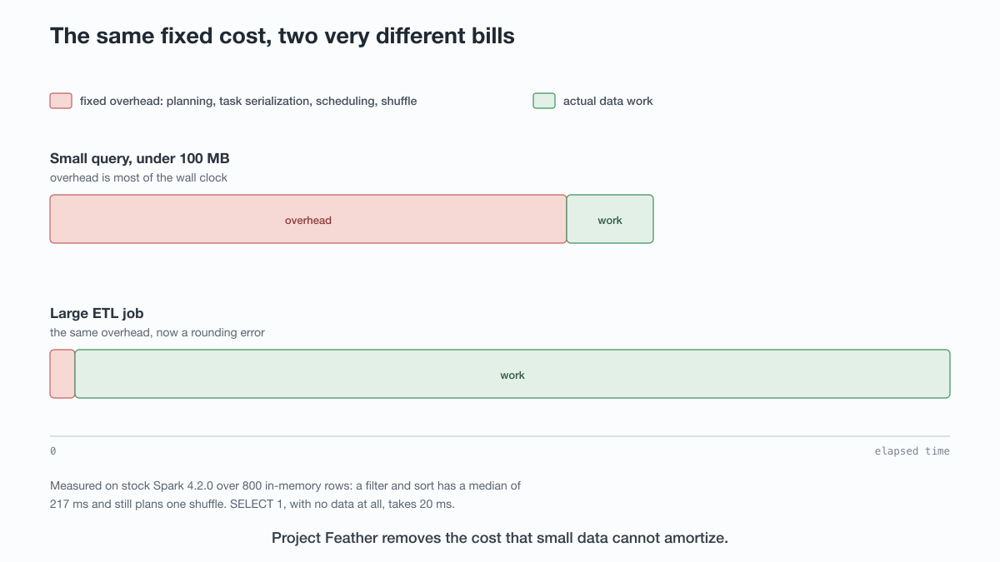
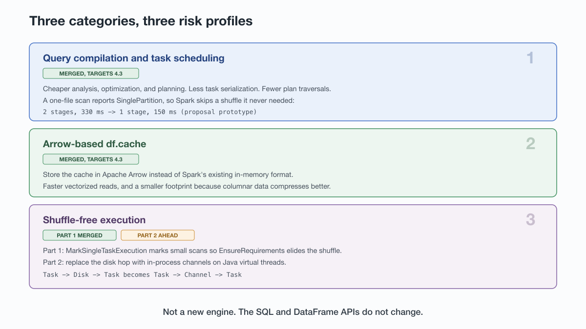
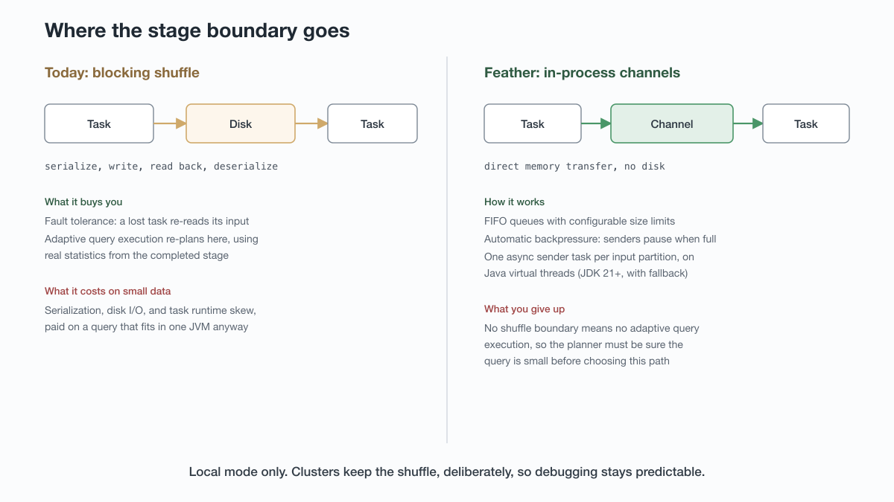

# How Project Feather makes Spark fast on a laptop

*By Lisa N. Cao and Daniel Tenedorio*

## Key takeaways

- **Project Feather ([SPARK-56978](https://issues.apache.org/jira/browse/SPARK-56978)) is a Spark improvement proposal to cut local-mode latency**, targeting the case where you are prototyping on a laptop over a small dataset rather than running a distributed job.
- **The problem is accumulated overhead, not one bottleneck.** Scheduling, task serialization, plan traversal, and shuffles each cost tens of milliseconds, sometimes less. Invisible in an hour-long ETL job, dominant on 100 MB.
- **It is not a new engine.** The SQL and DataFrame APIs stay exactly as they are. Feather is a collection of targeted optimizations under one theme, grouped into three categories.
- **The end state needs no flags, but the current state does.** Spark knows when it is in local mode, and the goal is that these optimizations apply there automatically. While the work stabilizes, the shuffle-free rule ships disabled behind `spark.sql.optimizer.singleTaskExecution.*`, so early adopters opt in by hand.
- **On stock Spark 4.2, an 800-row filter-and-sort still plans a shuffle it does not need, and a session takes three seconds or more to start.** The shuffle is what Feather removes. Session startup was raised in the SPIP's comment thread and explicitly deferred by the authors to separate work.

## Can I use this today?

No. Apache Spark 4.2.0 is the current release and **none of Feather's configuration flags exist in it**, which you can confirm by probing a session; release notes are easy to misread. The merged work is present in `branch-4.3` with fix version 4.3.0, which has not shipped, and the SPIP estimates three to six months depending on staffing.

What you can do now is measure your own baseline, so that when 4.3 arrives the improvement is a number you own:

```bash
python3 bench/feather_baseline.py --reps 15
```

The harness ships alongside this post in `bench/`.

The rest of this post covers why the overhead exists, what the three categories of work change, and what the tradeoffs are.

## What is Project Feather?

Project Feather is a Spark Improvement Proposal, authored by Daniel Tenedorio and Liang-Chi Hsieh, to make Apache Spark queries run faster in local mode. It was discussed on the Spark developer list from 4 May 2026 and passed its vote on 20 May 2026, which is when the umbrella JIRA was created. It targets small-data interactive work: the prototyping loop on a laptop, not the distributed pipeline.

Feather's goal is narrower than "make Spark fast." The proposal does not aim to outperform specialized single-node engines. It aims to lower the barrier to entry, so that someone starting out on a laptop has a reasonable experience and can grow into a cluster later without switching tools.

## Why is Spark slow on small data?

Because Spark's architecture is built for distributed reliability, and that machinery has a fixed cost per query that small datasets cannot amortize.

Every query gets a plan, stages, and tasks. The scheduler dispatches those tasks to executors. Along the way Spark serializes and deserializes task descriptions, traverses the query plan repeatedly for analysis and optimization, and inserts blocking shuffles at stage boundaries so that adaptive query execution can re-plan based on real statistics. All of it serves fault tolerance, transient failure recovery, and adaptive query execution.

Each cost is small on its own, tens of milliseconds and sometimes less. Nobody notices in a job that runs for an hour. The SPIP states the small-data consequence directly: queries over less than 100 MB can take three seconds or more.

That is the gap that sends people to a specialized single-node engine for exploratory work, and it is the reason the proposal exists. The SPIP does not rest on the authors' own impressions. It cites three third-party pieces on Spark's small-data performance: a Spark versus Dask comparison, an essay on Spark and not-so-big data, and a runtime benchmark. The motivation is a reputation problem visible from outside the project.



### What the overhead looks like on Spark 4.2

Measured on stock Spark 4.2.0, before any Feather work is available, over an in-memory table of 800 rows. One run, 15 repetitions per query, medians reported. The spread is wide because a laptop under real load is noisy, which is the reason to prefer your own numbers over these:

| Operation | Median | Range | Shuffles in plan |
|---|---|---|---|
| Session creation | 4.1 s | 2.9 to 4.9 s across cold starts | n/a |
| `SELECT s FROM t WHERE g = 3 ORDER BY id` | 218 ms | 137 to 406 ms | 1 |
| `SELECT g, count(*) FROM t GROUP BY g` | 127 ms | 71 to 956 ms | 1 |
| Query over a cached DataFrame | 36 ms | 28 to 62 ms | n/a |
| `SELECT 1` | 20 ms | 11 to 65 ms | n/a |

A sort over 800 rows plans a shuffle it does not need, because the planner does not know the scan is small enough to run in one task. You can see it in the plan today:

```
AdaptiveSparkPlan isFinalPlan=false
+- Project [s#2]
   +- Sort [id#0L ASC NULLS FIRST], true, 0
      +- Exchange rangepartitioning(id#0L ASC NULLS FIRST, 200), ENSURE_REQUIREMENTS
         +- Project [cast(id#0L as string) AS s#2, id#0L]
            +- Filter ((id#0L % 7) = 3)
               +- Range (0, 800, step=1, splits=10)
```

The `Exchange rangepartitioning(..., 200)` line is the cost in question. Spark shuffles 800 rows across 200 partitions so the sort has the range partitioning it requires, on data that fits in one task. `ENSURE_REQUIREMENTS` marks the exchange as added to satisfy that requirement rather than because the data needed moving. That is the node Feather's rule removes. And `SELECT 1` still costs around 20 milliseconds even though it is constant-folded on the driver and never launches a task at all. That figure is the floor imposed by parsing, analysis, planning, and the client round trip on their own.

Medians across repeated runs, with session creation measured in a fresh process each time.

Session creation is not part of the proposal. It came up in discussion, and the authors' reply was that it could be useful to look at but risked making the SPIP too complex, so it was left for separate investigation. The motivation raised was automated test cycles, where every run starts a new session. It appears in no milestone and no subtask.

## What are the three categories of work?

Feather groups its optimizations into three tracks. The split matters because they have different risk profiles and different delivery timelines.

| Category | What it changes | Merged? | Usable when? |
|---|---|---|---|
| Query compilation and task scheduling | Cheaper analysis, optimization, and planning; less task serialization | No subtask filed yet | Unscheduled |
| Arrow-based `df.cache` | Arrow cache serializer offered *alongside* the default ([SPARK-57268](https://issues.apache.org/jira/browse/SPARK-57268)) | Yes | 4.3, opt-in via `spark.sql.cache.serializer` |
| Shuffle-free execution, part 1 | Small queries run in one task ([SPARK-57851](https://issues.apache.org/jira/browse/SPARK-57851)) | Yes | 4.3, **off by default** and capped at 1,000 rows for in-memory relations |
| Shuffle-free execution, part 2 | In-process channels replace the disk hop | No, not yet contributed | Unscheduled |
| Local repartition | In-process hash repartitioning ([SPARK-57399](https://issues.apache.org/jira/browse/SPARK-57399)) | No, ticket open | Unscheduled |

"Merged" and "usable" are different things, which is easy to miss when reading JIRA. Merged means the code is present in `branch-4.3`. None of it reaches you until 4.3 is released, and two of the three pieces then still need configuration: the shuffle-free rule defaults to off, and the Arrow cache requires selecting a different cache serializer.

Category 1 needs a caveat. The SPIP describes it and the prototype numbers below come from it, but the umbrella has three subtasks and none is Category 1, so that milestone has not started as filed work.



### Category 1: stop paying for planning you do not need

Query compilation covers analysis, optimization, and physical planning. On large data it is noise; on small data it dominates.

In the proposal's example, when the planner knows a scan comprises exactly one file, it can report `SinglePartition` output partitioning instead of the default `UnknownPartitioning`. That lets Spark skip an intermediate shuffle before a following aggregation or hash join. In the proposal's prototype, a filter-and-sort over a few thousand rows went from two stages and 330 milliseconds to one stage and 150 milliseconds. A 2x improvement, from deleting a shuffle that was never needed for correctness.

A larger piece in this category is the [single-pass analyzer](https://issues.apache.org/jira/browse/SPARK-49834), a separate SPIP that rewrites Catalyst's analysis as one bottom-up tree traversal. That work is incremental and long-running, with pieces landing across 4.0 and 4.1. The bar the authors set for it is strict: query plans must be identical before and after the rewrite, which is enforced rather than hoped for.

### Category 2: make the cache worth using

`df.cache` is the workhorse of ad hoc analysis. You do the expensive part once, cache it, then iterate against the cached result. It is important enough to Feather that it got its own track.

Arrow format replaces Spark's existing in-memory cache representation as an option, not as the default. Two payoffs are expected: vectorized columnar reads, and a smaller footprint from Arrow IPC compression, so more of the working set fits in memory.

Benchmark results are already in the tree. The committed benchmarks (`sql/core/benchmarks/ArrowCacheBenchmark-*-results.txt`) show Arrow competitive with or faster than the default on primitive and columnar workloads, with the largest win on the zero-copy re-cache path, and the default still faster at higher compression levels. That mixed picture is why it ships opt-in.

Per the proposal, the risk is that conversion cost to and from Arrow exceeds what compression and vectorized reads win back, to be settled by microbenchmark.

### Category 3: stop shuffling through the disk

Category 3 is the most invasive change and the one still mostly ahead.

Spark's stages are separated by blocking shuffles. Data is serialized, written to disk, then read back by the next stage. For a distributed job that boundary is what makes fault tolerance and adaptive re-planning possible. For a query that fits on one node, it is pure cost.

Feather's approach has two parts. The first, already merged for 4.3, is a conservative optimizer rule (`MarkSingleTaskExecution`) that matches a plan reading a single small file, or a small in-memory relation, with at most one shuffle-inducing operator on top: sort, aggregate, window, expand, or limit and offset. Eligible scans then report `SinglePartition` output partitioning, which lets `EnsureRequirements` elide the shuffle. It is gated behind `spark.sql.optimizer.singleTaskExecution.enabled`, a public config that defaults to false, alongside internal per-operator and threshold sub-flags under the same prefix. Joins are deliberately excluded from this first pass.



For the second part, not yet contributed, in-process channels replace the disk hop:

```
Traditional execution:        Multi-threaded execution:
Task -> Disk -> Task          Task -> Channel -> Task (in-process)
Serialize to and from disk     Direct memory transfer
```

Each input partition gets its own asynchronous sender task on a Java virtual thread, and threads communicate over FIFO channels with automatic backpressure. Documented risks follow: a dependency on JDK 21 or later if virtual threads are used, which the proposal frames as conditional, with fallback to platform threads for older JDKs, since Spark's compile baseline is still Java 17; buffer sizing that could cause out-of-memory crashes if misconfigured, mitigated with conservative defaults; and the deadlock risk inherent in any channel-and-lock design.

There is also a deliberate loss. Adaptive query execution works at shuffle boundaries. Remove the shuffle and you remove AQE's opportunity to re-plan, which is exactly why the planner has to be confident the query is small before choosing this path.

## Will this work on clusters too?

Not initially, and the proposal's stated reason is a capability constraint rather than a preference.

Shuffle-free execution only works when all data fits and is processed in a single JVM, so it cannot replace distributed shuffle. Worth noting that the merged rule does not itself detect local mode: eligibility comes from plan shape and scan size, and the config is what keeps it away from cluster jobs today. The authors could extrapolate some of it to clusters later, and some pieces, particularly the planning and serialization work, are general enough to help everywhere. Daniel also raised a maintenance concern in conversation: a second execution path in distributed jobs means anyone debugging a production pipeline has to ask which path their query took.

In the proposal's words, improvements to cluster execution will be tangential only.

## How does this relate to Spark Connect?

Project Feather and Spark Connect are independent, and both should improve.

Spark Connect decouples the client from the cluster, so you write logic against one API and run it against a Spark driver elsewhere. It solves a version-coupling problem: upgrade the cluster without rewriting jobs, use clients in different languages, and keep memory-hungry client work from competing with the driver's planning memory.

Feather is about how fast the engine executes locally. You can run a Spark Connect server on your own machine, connect a local client, and get Feather's benefits; you can also use classic mode, where your program becomes the driver, and get them there too. Spark Connect is the better default for most people because the same code moves between a laptop and any cluster without changes, but it is orthogonal to what Feather does.

## How will we know if it worked?

Three milestones are committed in the SPIP, one per category, plus a reproducibility requirement that is the most useful part for anyone evaluating the work later:

| Milestone | Scope |
|---|---|
| 1 | The query compilation and task scheduling improvements, grouped as one milestone since they are many small independent changes |
| 2 | Implement and launch the columnar `df.cache` |
| 3 | Implement and launch multi-threaded shuffle-free execution in local mode |

A performance check accompanies them: macro-benchmarks for each milestone so the gains are reproducibly verifiable. That matters because the answer to "how much faster" depends on your machine, your data, and your query shape. A committed benchmark suite means the claim can be checked rather than taken on faith, which is also why the companion harness measures your baseline instead of quoting someone else's speedup.

## How do I measure my own baseline?

Session creation time, small-query latency, and the shuffle count in your plans are what the harness reports, small-query latency, and the shuffle count in your plans, and probes for Feather's configs so the same script tells you when your build has them:

```
Spark 4.2.0 on Darwin arm64
Feather configs present: 0 of 9
Arrow cache serializer active: False
  -> This Spark predates Feather. Numbers below are the baseline it improves on.

  session creation        4080.9 ms
  filter + sort            218.4 ms (median of 15)   exchanges=1
  aggregate                127.3 ms (median of 15)   exchanges=1
  cached query              35.9 ms (median of 15)
  SELECT 1                  19.8 ms (median of 30)
```

It builds an 800-row in-memory table by default, deliberately toy-sized to isolate fixed overhead from data-processing time, and deliberately under the 1,000-row cap that Spark 4.3's shuffle-free rule applies to in-memory relations, so the fixture stays eligible after you upgrade. Use `--rows` for something closer to your workload; the script warns you when you cross that cap. `SELECT 1` runs twice the repetitions because it is the fastest measurement and the noisiest in relative terms. The numbers are machine-dependent, so treat them as a personal before-and-after; comparing against this post's numbers will mislead you.

Run it once now and again after upgrading to 4.3, and the delta is your answer rather than someone else's benchmark.

## Frequently asked questions

**Will I need to change my code or set flags?**

Eventually no, but today yes. The design goal is that Spark detects local mode and applies these optimizations without you asking. Until the work settles, the shuffle-free rule ships off by default, and turning it on means setting `spark.sql.optimizer.singleTaskExecution.enabled` yourself. These are session configs you can set like any other, not developer-only switches.

**Does this make Spark competitive with single-node engines like DuckDB or Polars?**

The proposal aims to lower the barrier to entry so a beginner on a laptop has a reasonable experience, not to win single-node benchmarks. The argument for staying on Spark is the ecosystem and the fact that the same code scales to a cluster without a migration.

**Will Spark ever be a millisecond-latency serving system?**

No. The proposal sets no latency target and does not discuss serving. Its stated aim is usability and interactivity for small-data prototyping; the only figure it quantifies is the problem, queries under 100 MB taking three seconds or more.

**How can I get involved?**

The umbrella JIRA [SPARK-56978](https://issues.apache.org/jira/browse/SPARK-56978) and its subtasks are where the work is tracked now; the DISCUSS and VOTE threads closed in May 2026. Pull requests are welcome, and the open subtask on local repartition is the clearest place to help. The authors engaged with community suggestions in the document's comment thread, though not everything raised was adopted: session creation was acknowledged and deferred to separate work.

## About the authors

**Daniel Tenedorio** is a software engineer working on Apache Spark and a Spark committer, with over four years contributing to the project, initially on SQL features. He co-authored the Project Feather SPIP with Liang-Chi Hsieh.

**Lisa N. Cao** works on Apache Spark at Databricks and hosts the Apache Spark YouTube channel.

*This article draws on a conversation on the Apache Spark YouTube channel and on the [public SPIP document](https://docs.google.com/document/d/1Nphejrf_vh4YRECn0JPgKClqxDS_lB6wufZFJQxyY98/edit). Claims attributed to the proposal were checked against that document and its comment thread. Config names, defaults, and merge status were read from `branch-4.3` of the Apache Spark source and from JIRA, not from the interview: where the two disagreed, the source won. Benchmark figures come from a single run of the included harness on an Apple silicon laptop and are reproducible with it. [Link to video]*
